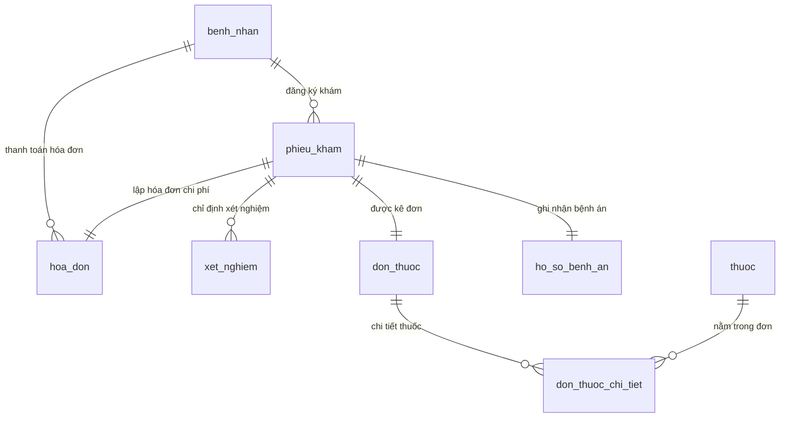

# ClinicManagerSystem - Hệ Thống Quản Lý Phòng Khám Đa Khoa

ClinicManagerSystem là giải pháp phần mềm quản lý toàn diện dành cho các phòng khám đa khoa, hỗ trợ tối ưu quy trình từ tiếp nhận bệnh nhân, đặt lịch hẹn, khám lâm sàng, chỉ định cận lâm sàng, chẩn đoán, kê đơn, cho tới quản lý hóa đơn và kết xuất báo cáo thống kê dịch tễ, doanh thu.

---

## 1. Công Nghệ & Phiên Bản (Tech Stack)

Hệ thống được phát triển với các công nghệ hiện đại, đảm bảo tính mở rộng, hiệu năng cao và bảo mật:

*   **Ngôn ngữ chính**: Java 17
*   **Framework**: Spring Boot 4.x (tương thích các tính năng REST APIs, Security)
*   **Quản lý build**: Maven
*   **Cơ sở dữ liệu**: MySQL 8.x
*   **Quản lý Schema DB**: Flyway Migration (các file đặt tại `src/main/resources/db/migration`)
*   **Xác thực & Phân quyền**: JWT (`jjwt` phiên bản `0.11.5`) & Spring Security
*   **Ánh xạ đối tượng (Mapping)**: MapStruct 1.6.x (tự động hóa mapping giữa Domain, Entity và DTO)
*   **Tiện ích giảm code Boilerplate**: Lombok (sử dụng ở tầng Application, Presentation và Infrastructure)
*   **Kiểm thử đơn vị**: JUnit 5 & Mockito (127 ca kiểm thử tự động)

---

## 2. Cấu Trúc Thư Mục & Kiến Trúc Sạch (Clean Architecture)

ClinicManagerSystem tuân thủ nghiêm ngặt mô hình **Clean/Hexagonal Architecture** nhằm tách biệt hoàn toàn logic nghiệp vụ cốt lõi (Domain) khỏi các framework hiển thị và lưu trữ vật lý.

### Sơ đồ Kiến trúc phân lớp:
```
           ┌────────────────────────────────────────────────────────┐
           │                      PRESENTATION                      │
           │  (Controllers, Request/Response DTOs, Global Advice)   │
           └───────────────────────────┬────────────────────────────┘
                                       │
                                       ▼
           ┌────────────────────────────────────────────────────────┐
           │                       APPLICATION                      │
           │   (Use Cases, Ports - Interfaces, DTOs, Mappers)       │
           └─────────────┬────────────────────────────▲─────────────┘
                         │                            │
                         ▼                            │
           ┌───────────────────────────┐    ┌─────────┴─────────────┐
           │          DOMAIN           │    │    INFRASTRUCTURE     │
           │ (Models, Value Objects,   │◄───┤ (JPA Entities, Repos, │
           │  Services, Exceptions)    │    │  Security, Ex Clients)│
           └───────────────────────────┘    └───────────────────────┘
```

### Cấu trúc gói (Package Structure) chi tiết:
```
backend/src/main/java/com/clinicmanager/
│
├── domain/                          # TẦNG NGHIỆP VỤ CỐT LÕI (Cấm import Spring/JPA)
│   ├── model/                       # Domain Entities mang logic (Immutable, final fields, constructor validation)
│   ├── valueobject/                 # Value Objects bất biến (không có định danh)
│   ├── service/                     # Các Domain Services xử lý nghiệp vụ liên thực thể
│   └── exception/                   # Ngoại lệ nghiệp vụ kế thừa từ BusinessException
│
├── application/                     # TẦNG LOGIC ỨNG DỤNG (Chỉ phụ thuộc tầng Domain)
│   ├── usecase/                     # Lớp triển khai Use Case điều phối (UseCaseImpl)
│   ├── port/                        # Ports của hệ thống
│   │   ├── input/                   # Input Ports (UseCase interfaces phục vụ Presentation)
│   │   └── output/                  # Output Ports (Repository Ports phục vụ lưu trữ)
│   ├── dto/                         # DTO vận chuyển dữ liệu qua lại Presentation
│   └── mapper/                      # MapStruct mappers ánh xạ Domain <=> DTO
│
├── infrastructure/                  # TẦNG HẠ TẦNG (Chi tiết kỹ thuật, công nghệ)
│   ├── persistence/                 # JPA Entities, Spring Data Repositories & Adapters hiện thực Output Ports
│   ├── security/                    # Cấu hình Security, Filters, JWT Utilities
│   └── config/                      # Khai báo các Spring Bean cấu hình hệ thống
│
└── presentation/                    # TẦNG HIỂN THỊ / GIAO TIẾP NGOÀI
    ├── controller/                  # REST Controllers định nghĩa các đầu API HTTP
    ├── request/                     # DTO đầu vào (kèm Validation annotations như @NotNull, @Size...)
    ├── response/                    # Cấu trúc JSON trả về chuẩn hóa cho client
    └── advice/                      # Global Exception Handler chuyển đổi BusinessException thành ApiResponse lỗi
```

---

## 3. Thiết Kế Cơ Sở Dữ Liệu (ERD)

Cơ sở dữ liệu được thiết kế tối ưu, chuẩn hóa các mối quan hệ nhằm tránh lặp dữ liệu và tối ưu hóa tốc độ truy vấn.

### Biểu đồ Quan Hệ Thực Thể (Mermaid ERD):



### Các bảng cơ sở dữ liệu chính:

1.  **`benh_nhan` (Hồ sơ bệnh nhân)**:
    *   `ma_benh_nhan` (VARCHAR(36), PK): Mã định danh bệnh nhân (UUID).
    *   `ho_ten` (VARCHAR(255), NOT NULL): Họ và tên bệnh nhân.
    *   `ngay_sinh` (DATE, NOT NULL): Ngày sinh.
    *   `gioi_tinh` (VARCHAR(10), NOT NULL): Giới tính.
    *   `so_dien_thoai` (VARCHAR(15), UNIQUE): Số điện thoại liên lạc.
2.  **`phieu_kham` (Phiếu khám bệnh)**:
    *   `ma_phieu_kham` (VARCHAR(36), PK): Mã phiếu khám (UUID).
    *   `ngay_kham` (DATE, NOT NULL): Ngày khám bệnh.
    *   `trang_thai` (VARCHAR(50)): Trạng thái (`WAITING`, `EXAMINING`, `COMPLETED`, `CANCELLED`).
    *   `ma_benh_nhan` (VARCHAR(36), FK): Liên kết tới bảng `benh_nhan`.
    *   `chan_doan` (VARCHAR(1000)): Chẩn đoán lâm sàng của bác sĩ.
3.  **`ho_so_benh_an` (Hồ sơ bệnh án)**:
    *   `ma_benh_an` (VARCHAR(36), PK): Mã bệnh án.
    *   `chan_doan` (VARCHAR(1000), NOT NULL): Chẩn đoán bệnh cuối cùng của bác sĩ.
    *   `ngay_lap` (DATE, NOT NULL): Ngày lập hồ sơ bệnh án.
    *   `ma_phieu_kham` (VARCHAR(36), FK, UNIQUE): Liên kết tới `phieu_kham`.
4.  **`xet_nghiem` (Chỉ định xét nghiệm cận lâm sàng)**:
    *   `ma_xet_nghiem` (VARCHAR(36), PK): Mã xét nghiệm.
    *   `loai_xet_nghiem` (VARCHAR(255)): Tên loại xét nghiệm.
    *   `ket_qua` (VARCHAR(1000)): Kết quả trả về của Kỹ thuật viên.
    *   `ngay_xet_nghiem` (DATE): Ngày thực hiện xét nghiệm.
    *   `ma_phieu_kham` (VARCHAR(36), FK): Liên kết tới `phieu_kham`.
5.  **`don_thuoc` (Đơn thuốc bác sĩ kê)**:
    *   `ma_don_thuoc` (VARCHAR(36), PK): Mã đơn thuốc.
    *   `ngay_ke` (DATE, NOT NULL): Ngày kê đơn.
    *   `ma_phieu_kham` (VARCHAR(36), FK, UNIQUE): Liên kết tới `phieu_kham`.
6.  **`don_thuoc_chi_tiet` (Chi tiết đơn thuốc)**:
    *   `ma_don_thuoc` (VARCHAR(36), PK, FK): Liên kết tới `don_thuoc`.
    *   `ma_thuoc` (VARCHAR(36), PK, FK): Liên kết tới danh mục `thuoc`.
    *   `so_luong` (INT, NOT NULL): Số lượng thuốc cấp phát.
    *   `lieu_dung` (VARCHAR(500)): Hướng dẫn liều dùng.
7.  **`hoa_don` (Hóa đơn viện phí)**:
    *   `ma_hoa_don` (VARCHAR(36), PK): Mã hóa đơn.
    *   `so_hoa_don` (VARCHAR(50), UNIQUE): Số hóa đơn phục vụ in ấn (Ví dụ: `INV-10023`).
    *   `tien_kham` (DECIMAL(15,2)): Tiền khám lâm sàng.
    *   `tien_xet_nghiem` (DECIMAL(15,2)): Tiền chỉ định cận lâm sàng.
    *   `tien_thuoc` (DECIMAL(15,2)): Tiền cấp phát đơn thuốc.
    *   `tong_tien` (DECIMAL(15,2)): Tổng số tiền cần thanh toán.
    *   `trang_thai` (VARCHAR(50)): Trạng thái (`UNPAID`, `PAID`, `CANCELLED`).
    *   `ma_benh_nhan` (VARCHAR(36), FK): Liên kết tới `benh_nhan`.
    *   `ma_phieu_kham` (VARCHAR(36), FK, UNIQUE): Liên kết tới `phieu_kham`.

---

## 4. Luồng Xử Lý Dữ Liệu (Data Flow)

Để đảm bảo hiệu năng tối ưu và tránh lỗi N+1 Query kinh điển khi làm việc với các hệ thống báo cáo hoặc xử lý danh sách lớn, ClinicManagerSystem áp dụng mô hình **In-Memory Grouping** (Gom nhóm và tính toán trên bộ nhớ):

1.  **Yêu cầu API**: Client gửi yêu cầu kèm theo bộ lọc tới REST Controller.
2.  **Xác thực phân quyền**: Spring Security chặn Request, kiểm tra tính hợp lệ của token JWT và phân quyền của User (ví dụ: chỉ cho phép `QUAN_LY` xem báo cáo).
3.  **Use Case xử lý**:
    *   Truy vấn tập hợp gốc (Ví dụ: Lấy toàn bộ Phiếu khám hoặc Hóa đơn thuộc khoảng ngày lọc) bằng 1 câu SQL duy nhất.
    *   Nếu cần thông tin bổ sung (Xét nghiệm, Đơn thuốc), trích xuất danh sách ID của tập hợp gốc, gửi truy vấn `IN` tới DB để nạp toàn bộ thực thể liên quan (Giảm số lượng truy vấn xuống còn $O(1)$ thay vì $O(N)$).
    *   Sử dụng cấu trúc dữ liệu Map (`HashMap`) của Java để nhóm, đếm tần suất và tính toán phần trăm trực tiếp trên bộ nhớ (In-memory aggregation).
    *   Làm đầy dữ liệu (Backfilling) các ngày trống đối với các báo cáo theo ngày.
4.  **Trả về**: Ánh xạ dữ liệu tính toán được sang DTO qua MapStruct, bọc vào đối tượng `ApiResponse` chuẩn hóa và phản hồi về client.

---

## 5. Lộ Trình Phát Triển 27 Use Case (Roadmap)

Dự án được xây dựng tuần tự qua 5 giai đoạn chính nhằm đảm bảo tính kế thừa dữ liệu cao nhất:

### Giai đoạn 1: Nền tảng & Master Data
*   **UC03, UC04, UC05**: CRUD & Tra cứu hồ sơ bệnh nhân.
*   **UC20, UC21**: Thiết lập danh mục Dịch vụ khám và Danh mục Thuốc.
*   **UC22, UC23**: CRUD Tài khoản người dùng và Phân quyền truy cập hệ thống.

### Giai đoạn 2: Tiếp nhận & Đặt lịch hẹn
*   **UC01, UC02**: Đặt và hủy lịch hẹn khám bệnh trực tuyến.
*   **UC06, UC07**: Đăng ký khám tại quầy và lập phiếu khám bệnh cho bệnh nhân.

### Giai đoạn 3: Lâm sàng & Cận lâm sàng (Khám bệnh)
*   **UC08, UC09**: Khám lâm sàng cơ bản và chỉ định xét nghiệm cận lâm sàng.
*   **UC10, UC11**: Kỹ thuật viên tiếp nhận và cập nhật kết quả xét nghiệm.
*   **UC12, UC13**: Bác sĩ chẩn đoán bệnh và tiến hành kê đơn thuốc.
*   **UC14**: Cập nhật bệnh án của bệnh nhân.

### Giai đoạn 4: Chi phí & Thanh toán
*   **UC16, UC15**: Tính chi phí khám và lập hóa đơn tương ứng.
*   **UC17, UC18**: Thực hiện thanh toán và xác nhận thanh toán thành công.
*   **UC19**: Kết xuất và in hóa đơn giấy cho bệnh nhân.

### Giai đoạn 5: Báo cáo & Thống kê (Dành cho Quản lý)
*   **UC25**: Xem báo cáo số lượt khám (Thống kê số lượng tiếp nhận).
*   **UC24**: Xem báo cáo doanh thu (Tổng hợp thực tế theo dịch vụ/thuốc/khám).
*   **UC26**: Xem báo cáo tỷ lệ khám bệnh (Tỷ lệ cần xét nghiệm / kê đơn thuốc).
*   **UC27**: Xem báo cáo xu hướng mắc bệnh (Thống kê dịch tễ các bệnh phổ biến nhất).

---

## 6. Tài Liệu REST API Chính

Dưới đây là một số API Endpoints cốt lõi của hệ thống:

| Phương thức | API Endpoint | Mô tả | Quyền Truy Cập |
| :--- | :--- | :--- | :--- |
| **POST** | `/api/auth/login` | Đăng nhập hệ thống, lấy JWT Token | Public |
| **POST** | `/api/patients` | Thêm mới hồ sơ bệnh nhân (UC03) | `LE_TAN`, `BAC_SI` |
| **GET** | `/api/patients/search` | Tra cứu bệnh nhân theo tên/SĐT (UC05) | `LE_TAN`, `BAC_SI` |
| **POST** | `/api/appointments` | Đặt lịch hẹn khám bệnh (UC01) | Public / `LE_TAN` |
| **POST** | `/api/admissions/slips` | Lập phiếu khám bệnh (UC07) | `LE_TAN` |
| **POST** | `/api/examinations/records` | Chẩn đoán & Kế đơn lập bệnh án (UC14)| `BAC_SI` |
| **POST** | `/api/payments/invoices` | Lập hóa đơn viện phí (UC15) | `THU_NGAN` |
| **POST** | `/api/payments/invoices/{id}/pay`| Thanh toán & Xác nhận hóa đơn (UC18) | `THU_NGAN` |
| **GET** | `/api/reports/revenue` | Báo cáo doanh thu (UC24) | `QUAN_LY` |
| **GET** | `/api/reports/examination-count`| Báo cáo số lượt khám bệnh (UC25) | `QUAN_LY` |
| **GET** | `/api/reports/examination-ratio`| Báo cáo tỷ lệ khám bệnh (UC26) | `QUAN_LY` |
| **GET** | `/api/reports/disease-trend` | Báo cáo xu hướng mắc bệnh (UC27) | `QUAN_LY` |

---

## 7. Cài Đặt & Chạy Ứng Dụng (Installation & Run Guide)

### 7.1. Yêu cầu hệ thống (Prerequisites)
*   **Java JDK 17**
*   **Apache Maven 3.8+**
*   **MySQL Server 8.x**

### 7.2. Cấu hình Cơ sở dữ liệu
1.  Tạo cơ sở dữ liệu trống trong MySQL:
    ```sql
    CREATE DATABASE clinic_manager_db CHARACTER SET utf8mb4 COLLATE utf8mb4_unicode_ci;
    ```
2.  Tạo tệp cấu hình chứa thông tin mật khẩu cục bộ của bạn:  
    Tạo tệp `application_secrets.properties` nằm tại thư mục `backend/src/main/resources/` (Tệp này đã được cấu hình trong `.gitignore` để tránh bị lộ khóa bảo mật):
    ```properties
    spring.datasource.username=your_mysql_username
    spring.datasource.password=your_mysql_password
    jwt.secret=your_super_secret_jwt_key_with_at_least_256_bits
    ```

### 7.3. Biên dịch và Kiểm thử
*   Để biên dịch toàn bộ dự án backend:
    ```bash
    mvn clean compile
    ```
*   Để chạy toàn bộ **127 ca kiểm thử tự động** (đảm bảo tính ổn định của dự án):
    ```bash
    mvn test
    ```

### 7.4. Chạy ứng dụng
Chạy trực tiếp ứng dụng thông qua plugin Maven của Spring Boot:
```bash
mvn spring-boot:run
```
Ứng dụng sẽ tự động:
1.  Quét và thực thi toàn bộ các file SQL Migration thông qua **Flyway** để dựng bảng và chèn dữ liệu master khởi tạo (Seed data).
2.  Lắng nghe các yêu cầu tại cổng mặc định `http://localhost:8080`.
